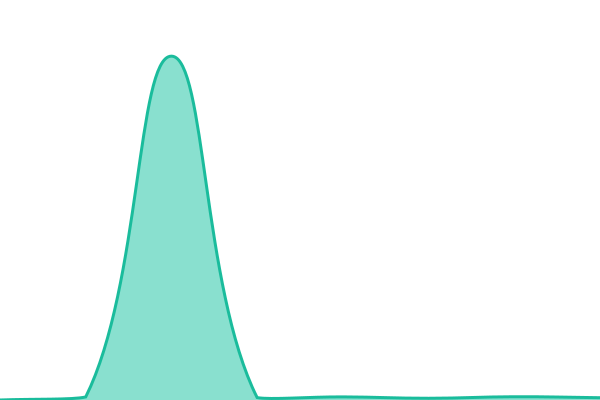
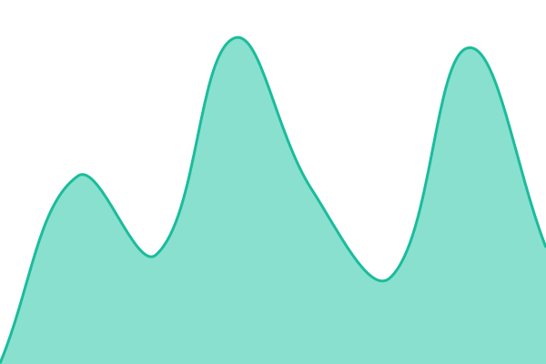

# [📈 Live Status](https://status.wealthtechpros.com): <!--live status--> **🟩 All systems operational**

This repository contains the open-source uptime monitor and status page for [WealthTech Pros](https://www.wealthtechpros.com/), powered by [Upptime](https://github.com/upptime/upptime).

With [Upptime](https://upptime.js.org), you can get your own unlimited and free uptime monitor and status page, powered entirely by a GitHub repository. We use [Issues](https://github.com/WealthTechPros/status/issues) as incident reports, [Actions](https://github.com/WealthTechPros/status/actions) as uptime monitors, and [Pages](https://status.wealthtechpros.com) for the status page.

<!--start: status pages-->
<!-- This summary is generated by Upptime (https://github.com/upptime/upptime) -->
<!-- Do not edit this manually, your changes will be overwritten -->
<!-- prettier-ignore -->
| URL | Status | History | Response Time | Uptime |
| --- | ------ | ------- | ------------- | ------ |
|  [Client Onboarding — Prod](https://clientonboarding.wealthtechpros.com) | 🟩 Up | [client-onboarding-prod.yml](https://github.com/WealthTechPros/status/commits/HEAD/history/client-onboarding-prod.yml) | 

 516ms
     
 | 

<a href="https://status.wealthtechpros.com/history/client-onboarding-prod">100.00%</a>
    

|  [Client Onboarding — Login](https://login.clientonboarding.wealthtechpros.com) | 🟩 Up | [client-onboarding-login.yml](https://github.com/WealthTechPros/status/commits/HEAD/history/client-onboarding-login.yml) | 

 889ms
     
 | 

<a href="https://status.wealthtechpros.com/history/client-onboarding-login">100.00%</a>
    

|  [Client Onboarding — Benchmark](https://benchmark.clientonboarding.wealthtechpros.com) | 🟩 Up | [client-onboarding-benchmark.yml](https://github.com/WealthTechPros/status/commits/HEAD/history/client-onboarding-benchmark.yml) | 

 487ms
     
 | 

<a href="https://status.wealthtechpros.com/history/client-onboarding-benchmark">100.00%</a>
    

|  [Client Onboarding — Staging](https://staging.clientonboarding.wealthtechpros.com) | 🟩 Up | [client-onboarding-staging.yml](https://github.com/WealthTechPros/status/commits/HEAD/history/client-onboarding-staging.yml) | 

 532ms
     
 | 

<a href="https://status.wealthtechpros.com/history/client-onboarding-staging">100.00%</a>
    

|  [SGE](https://sgd.wealthtechpros.com) | 🟩 Up | [sge.yml](https://github.com/WealthTechPros/status/commits/HEAD/history/sge.yml) | 

 7699ms
     
 | 

<a href="https://status.wealthtechpros.com/history/sge">100.00%</a>
    

|  [WTP MCP](https://mcp.wealthtechpros.com) | 🟩 Up | [wtp-mcp.yml](https://github.com/WealthTechPros/status/commits/HEAD/history/wtp-mcp.yml) | 

 398ms
     
 | 

<a href="https://status.wealthtechpros.com/history/wtp-mcp">100.00%</a>
    

|  [WTP Marketing Site](https://wealthtechpros.com) | 🟩 Up | [wtp-marketing-site.yml](https://github.com/WealthTechPros/status/commits/HEAD/history/wtp-marketing-site.yml) | 

 106ms
     
 | 

<a href="https://status.wealthtechpros.com/history/wtp-marketing-site">100.00%</a>
    

|  [Project Management](https://projectmanagement.wealthtechpros.com) | 🟩 Up | [project-management.yml](https://github.com/WealthTechPros/status/commits/HEAD/history/project-management.yml) | 

 129ms
     
 | 

<a href="https://status.wealthtechpros.com/history/project-management">100.00%</a>
    

|  [WTP Assistant](https://assistant.wealthtechpros.com) | 🟩 Up | [wtp-assistant.yml](https://github.com/WealthTechPros/status/commits/HEAD/history/wtp-assistant.yml) | 

 451ms
     
 | 

<a href="https://status.wealthtechpros.com/history/wtp-assistant">100.00%</a>
    

|  [Trust Fabric](https://trust.wealthtechpros.com) | 🟩 Up | [trust-fabric.yml](https://github.com/WealthTechPros/status/commits/HEAD/history/trust-fabric.yml) | 

 881ms
     
 | 

<a href="https://status.wealthtechpros.com/history/trust-fabric">100.00%</a>
    

|  [Trust Fabric — Internal](https://trust.wealthtechpros.com/internal) | 🟩 Up | [trust-fabric-internal.yml](https://github.com/WealthTechPros/status/commits/HEAD/history/trust-fabric-internal.yml) | 

 791ms
     
 | 

<a href="https://status.wealthtechpros.com/history/trust-fabric-internal">100.00%</a>
    

|  [Trust Fabric — Deep Health](https://trust.wealthtechpros.com/api/health/deep) | 🟩 Up | [trust-fabric-deep-health.yml](https://github.com/WealthTechPros/status/commits/HEAD/history/trust-fabric-deep-health.yml) | 

 290ms
     
 | 

<a href="https://status.wealthtechpros.com/history/trust-fabric-deep-health">100.00%</a>
    

|  [Client Document Portal](https://portals.wealthtechpros.com) | 🟩 Up | [client-document-portal.yml](https://github.com/WealthTechPros/status/commits/HEAD/history/client-document-portal.yml) | 

 1094ms
     
 | 

<a href="https://status.wealthtechpros.com/history/client-document-portal">100.00%</a>
    

|  [Adviser MCP](https://adviser-mcp.wealthtechpros.com) | 🟩 Up | [adviser-mcp.yml](https://github.com/WealthTechPros/status/commits/HEAD/history/adviser-mcp.yml) | 

 587ms
     
 | 

<a href="https://status.wealthtechpros.com/history/adviser-mcp">100.00%</a>
    

<!--end: status pages-->

[**Visit our status website →**](https://status.wealthtechpros.com)

## 📄 License

- Powered by: [Upptime](https://github.com/upptime/upptime)
- Code: [MIT](./LICENSE) © [Anand Chowdhary](https://anandchowdhary.com)
- Data in the `./history` directory: [Open Database License](https://opendatacommons.org/licenses/odbl/1-0/)
